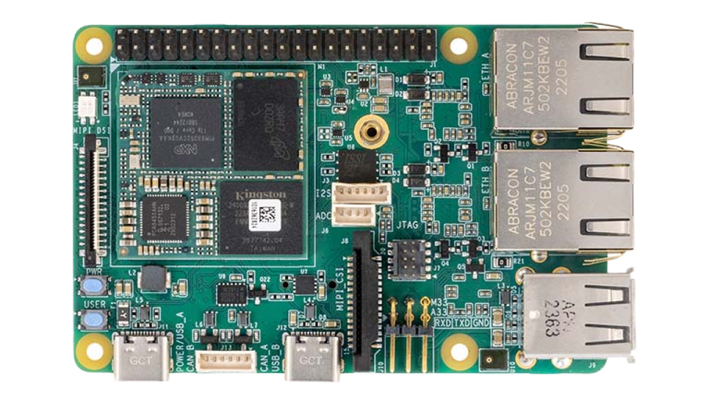

  # MaaXBoard-OSM93-HUB

Welcome to the information hub for MaaXBoard OSM93, featuring the NXP i.MX 93 processor on a solder down [MSC-OSM-SF-93](https://embedded.avnet.com/product/msc-osm-sf-imx93/) module to achieve low power, machine learning, computer vision, and intelligent edge applications. The i.MX 93 family features up to two Arm® Cortex®-A55 running at 1.7 GHz, an Arm Cortex-M33 core, and an Arm Ethos-U65 Micro NPU for edge AI/ML processing. This repository serves as a central hub for all resources related to MaaXBoard OSM93.
Note: Board images can be downloaded from the Releases section.

## Table of Contents 
- MaaXBoard-OSM-93-HUB
  - [Table of Contents](https://github.com/Avnet/MaaXBoard-OSM93-HUB?tab=readme-ov-file#table-of-contents)
  - [About](https://github.com/Avnet/MaaXBoard-OSM93-HUB?tab=readme-ov-file#about)
    - [Processing](https://github.com/Avnet/MaaXBoard-OSM93-HUB?tab=readme-ov-file#processing)
    - [Form Factor & Interfaces](https://github.com/Avnet/MaaXBoard-OSM93-HUB?tab=readme-ov-file#form-factor--interfaces)
    - [Memory & Storage](https://github.com/Avnet/MaaXBoard-OSM93-HUB?tab=readme-ov-file#memory--storage)
    - [Software & BSP](https://github.com/Avnet/MaaXBoard-OSM93-HUB?tab=readme-ov-file#software--bsp)
      - [Board Support Package](https://github.com/Avnet/MaaXBoard-OSM93-HUB?tab=readme-ov-file#board-support-package)
      - [Image Packages](https://github.com/Avnet/MaaXBoard-OSM93-HUB?tab=readme-ov-file#image-packages)
    - [Accessories](https://github.com/Avnet/MaaXBoard-OSM93-HUB?tab=readme-ov-file#accessories)
  - [Related Repositories](https://github.com/Avnet/MaaXBoard-OSM93-HUB?tab=readme-ov-file#related-repositories)
  - [Demos](https://github.com/Avnet/MaaXBoard-OSM93-HUB?tab=readme-ov-file#demos)
  - [Related Blogs](https://github.com/Avnet/MaaXBoard-OSM93-HUB?tab=readme-ov-file#related-blogs)
  - [Getting Started & Manuals](https://github.com/Avnet/MaaXBoard-OSM93-HUB?tab=readme-ov-file#getting-started--manuals)
      - [Product Brief](https://github.com/Avnet/MaaXBoard-OSM93-HUB?tab=readme-ov-file#product-brief)
      - [Getting Started Guide](https://github.com/Avnet/MaaXBoard-OSM93-HUB?tab=readme-ov-file#getting-started-guide)
      - [Development Guides](https://github.com/Avnet/MaaXBoard-OSM93-HUB?tab=readme-ov-file#development-guides)
      - [Release Notes](https://github.com/Avnet/MaaXBoard-OSM93-HUB?tab=readme-ov-file#release-notes)
  - [Development](https://github.com/Avnet/MaaXBoard-OSM93-HUB/tree/main/Development)
   
## About

MaaXBoard OSM93 is a feature rich development kit designed around the Raspberry Pi form factor. Various I/O interfaces are available on the board such as the standard 40pin Pi Hat connector, 2x CAN interface connectors, and 2x Gb Ethernet RJ45 connectors. This NXP i.MX 93 processor-based platform is ideal for development of accelerated edge AI computing with it's on-board NPU, versatile networking capabilities with it's dual ethernet ports, and industrial applicaions that require additional CAN bus interfaces. 

    
More information & Specs

### Processing

The NXP i.MX93 processor is architected with 3 separate processing domains: 
- Application domain with two Arm® Cortex®-A55 (1.7 GHz) cores 
- Real time domain with Arm® Cortex®-M33 (250 MHz) core
- Flex domain with Arm® Ethos-U65 NPU (1 GHz)

### Form Factor & Interfaces

MaaXBoard OMS93 follows the same form factor as the Rasperry Pi enabling seamless integration of the hardware into existing platforms using this standard.

    

    

    

An M.2 key-E connector on back of the board facilitates easy integration of optional NXP based tri-radio M.2 module solutions, for concurrent Wi-Fi 6, Bluetooth (5.3) and 802.15.4 wireless operation.

    

Installed onto the board is the MSC-OSM-SF-IMX93 solder down module. 

    

### Memory & Storage

### Software & BSP
Coming Soon!

### Board Support Package

### Image Packages

### Accessories
Coming soon!

### Related Repositories

### Demos

### Related Blogs
Coming Soon!

### Getting Started & Manuals

### Product Brief
- [Block Diagram](https://www.avnet.com/wps/wcm/connect/onesite/7cf18444-2d53-4061-9eb6-4500d34a3687/MaaXBoard_OSM93_BlockDiag_ProdBrief_18Mar2024.pdf?MOD=AJPERES&CACHEID=ROOTWORKSPACE.Z18_NA5A1I41L0ICD0ABNDMDDG0000-7cf18444-2d53-4061-9eb6-4500d34a3687-oVy9irI)

-[Product Brief](https://www.avnet.com/wps/wcm/connect/onesite/710506b4-a98c-453b-91a9-cade51251c3c/FY24_1345_MaaXBoard_OSM93_Product_Brief_R6.pdf?MOD=AJPERES&CACHEID=ROOTWORKSPACE.Z18_NA5A1I41L0ICD0ABNDMDDG0000-710506b4-a98c-453b-91a9-cade51251c3c-oX54Gw0)

### Getting Started Guide
Coming Soon!

### Development Guides
Coming Soon!

### Release Notes

